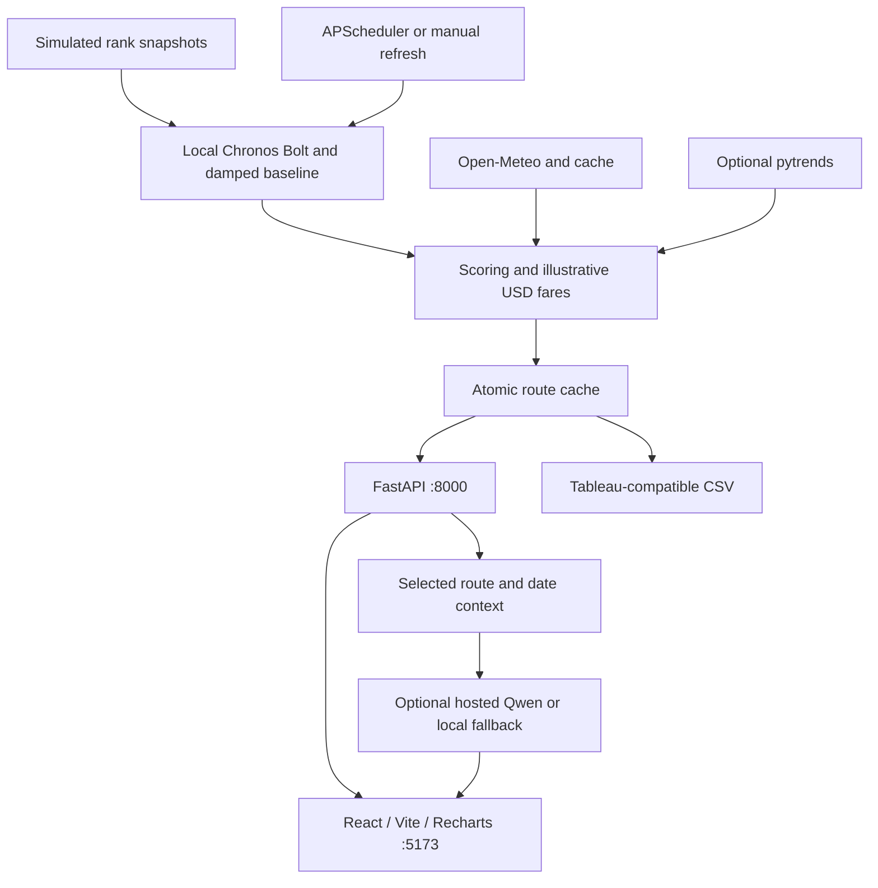

# TravelSols v1 — Route Intelligence

A React + FastAPI planning dashboard for route forecasts, destination weather,
illustrative pricing, travel-date comparison, AI explanations and Tableau CSV exports.

## Architecture and features

This is **part 1** of the suite: route intelligence, not a ticketing system.
React/Vite and Recharts render the dashboard; FastAPI exposes the route, weather,
advisor and export APIs. APScheduler refreshes the shared forecast cache.

- **Forecast dashboard:** compares route demand-index estimates and illustrative
  uncertainty ranges; it does not measure actual airline booking demand.
- **Weather and dates:** 14-day conditions, temperatures, modeled fares and a
  comfort-to-modeled-cost date recommendation.
- **Chatbot/advisor:** answers selected-route and travel-date questions using
  structured forecast/weather context. The default hosted model is
  `Qwen/Qwen3-4B-Instruct-2507`; errors produce a labeled local fallback.
- **Exports and status:** Tableau-ready CSV and integration/refresh diagnostics.

v1 does **not** use Neo4j, ChromaDB, BM25 or document RAG. Part 2 adds those
capabilities in [travelsolsv2](../travelsolsv2/README.md). See the
[suite README](../README.md) for both architectural diagrams and the graph schema.

## What is live, and what is simulated?

- Open-Meteo: live 14-day weather, cached for 30 minutes. No API key needed.
- Hugging Face: hosted Qwen advisor; responses are labeled live or local fallback.
- Google Trends: unofficial pytrends integration; empty responses/rate limits
  produce labeled fallback values. Fallback search values do not affect demand.
- Amazon Chronos Bolt: local CPU inference with a cached model, not an HF hosted API.
- GDS: hardcoded sample rank-index snapshots at 12, 8 and 2 weeks ago.
- Fares: deterministic illustrative USD base fares, not live airline inventory.
- Neo4j: not used by v1. The graph/policy retrieval project is in travelsolsv2.

The Integrations view and /api/health report provider status and live coverage.
The first refresh runs in the background; an empty initial route list is not a
database outage. Never put API tokens in frontend code or commit .env files.

## Forecasting and pricing

chronos_engine.py regularizes only between actual sample snapshots. Missing
observations remain missing; they are never filled with zero. A damped, bounded
trend extrapolation supplies the baseline. Chronos Bolt contributes 20% with
three observations, 10% with two, and 0% with fewer. The forecast horizon
accounts for the age of the last observation before returning four weeks
from today. Interpolation does not count as extra observed data.

Ranges blend heuristic baseline bounds and model quantiles. They are not
calibrated confidence intervals. These sparse simulated inputs cannot
demonstrate real booking-demand accuracy. For production, ingest regularly
sampled booking counts, perform rolling-origin holdout evaluations against
naive/seasonal baselines, and calibrate interval coverage.

Pricing uses forecast rank index plus a 20% live-only search-interest component.
Opportunity = 100 × (0.7 × demand + 0.3 × weather appeal).
Higher appeal means better conditions; weather is no longer inverted.

Demand factor = 0.75 + 1.25 × demand. Weather and specific competing destinations
supply bounded adjustments. Factors shrink toward neutral with distance
(exp(-day/28)), rather than creating arbitrary future discounts. The final
multiplier is bounded to 0.75–2.50. WMO code 0 is valid clear sky.
Unavailable weather uses a neutral factor; it is never presented as sunny.

The date recommendation maximizes comfort / modeled multiplier among dates
with available weather and appeal >= 0.5. It is a planning heuristic, not a
guaranteed cheapest flight. All UI, API and exported fares use USD.

## Run locally (PowerShell)

From travelsols:

    python -m venv venv
    .\venv\Scripts\python.exe -m pip install -r backend\requirements.txt
    Copy-Item backend\.env.example backend\.env

Edit backend/.env with your own HF token, then run:

    cd backend
    ..\venv\Scripts\python.exe -m uvicorn main:app --host 127.0.0.1 --port 8000

In another terminal, from travelsols/frontend:

    npm install
    npm run dev -- --host 127.0.0.1 --port 5173

Open http://127.0.0.1:5173. On Windows, double-click `../start_v1.bat` or
`start_all.bat` to start both servers and verify the frontend API proxy.
Background startup logs are in `../.startup-logs/`. The backend launcher uses
`travelsols/venv`, and its API runs at http://127.0.0.1:8000.
Use `start_backend.bat --install` or `start_frontend.bat --install` to refresh
dependencies; normal launches skip installation when dependencies are present.

Chronos defaults to amazon/chronos-bolt-small and local cached files. Set
CHRONOS_ALLOW_DOWNLOAD=true to allow the first model download. If the model
is absent, the app remains usable with a disclosed damped-trend fallback.
CHRONOS_ENABLED=false disables model loading. HF_MODEL overrides the advisor
model; choose a model available on the HF router with your token/provider access.

TLS verification stays enabled. network_config.py uses OS-trusted certificates
through truststore, including enterprise Windows roots. Do not use verify=False
or disable certificate checks to fix network issues.

## Workspace

Search and sort routes; switch departure airports; resize the route explorer
by dragging its separator or using Left/Right arrows when it is focused.
Width is saved locally. Under tablet width the layout adapts automatically.
Overview, Weather & dates, and AI advisor separate the main workflows.
Date selection updates the modeled fare, conditions and advisor context together.
Refresh data actually starts the backend pipeline; overlapping jobs are prevented
and old route data remains intact if a refresh fails.

## API

- GET /api/health — integration status, refresh state, timestamp, cache size.
- GET /api/origins — five supported Indian departure airports.
- GET /api/forecasts?origin=BOM&limit=25 — ranked routes.
- GET /api/forecast/BOM/DXB?day_offset=0 — route and 14-day schedules; offset 0–13.
- GET /api/weather/DXB — weather detail and source.
- POST /api/refresh — asynchronous refresh (202).
- POST /api/advisor/BOM/DXB — optional question and day_offset.
- GET /api/export/forecast/BOM/DXB — route CSV.
- GET /api/export/all-routes — workspace CSV.

CSV exports include source, model, observation-count and range fields.
Historical weather and unmodeled future fares are blank, not fabricated.
The former incorrectly named forecast_price_inr column is now forecast_price_usd.
Update existing Tableau field mappings accordingly.

## Verify

From travelsols/backend:

    ..\venv\Scripts\python.exe -m unittest discover -s tests -v

These regression tests use offline mocks and do not download models or call
external inference. The optional smoke test checks the already-running service:

    ..\venv\Scripts\python.exe tests\smoke_live.py
    ..\venv\Scripts\python.exe tests\smoke_live.py --advisor

The --advisor option makes one real hosted HF inference request, which can
consume provider credits. No token is printed.

From travelsols/frontend:

    npm run build
