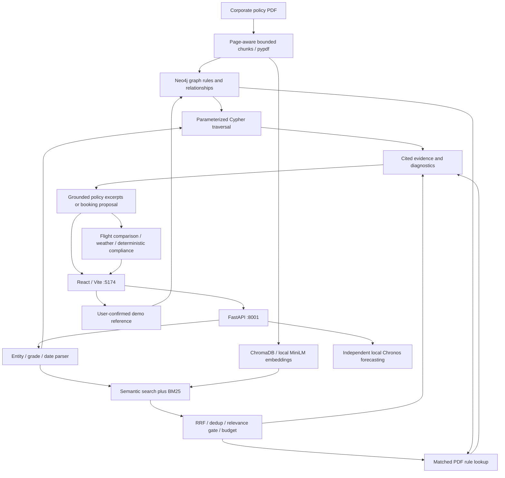

# TravelSols v2 — Local Forecasting and Policy-Aware Booking Demo

Three workspaces share one React/FastAPI app:

- Forecasts: local Amazon Chronos Bolt, route-rank sample history and weather.
- Booking: deterministic corporate-policy decisions, flight comparison and
  non-ticketing demo itinerary references.
- Policy graph: Neo4j relationships, policy search and local Chroma retrieval.

The forecasting pipeline is independent of Neo4j, Chroma, flight-search services,
Google Trends and hosted LLM inference. The existing weather feed is its only
network data source. Other booking/graph integrations remain separate features.

## Architecture: part 2 of the suite

React/Vite, Recharts and D3 provide the three workspaces. FastAPI separates the
forecast endpoints from policy retrieval and itinerary comparison. Neo4j stores
structured graph facts; local ChromaDB stores document text and MiniLM embeddings.
The default booking agent is deterministic, with optional LangChain ReAct and
`Qwen/Qwen2.5-7B-Instruct` hosted inference when `AGENT_MODE=llm` is configured.



### RAG and hybrid retrieval

`agent/graph_rag.py` coordinates graph traversal and document retrieval.
`agent/hybrid_retrieval.py` implements a local BM25 retriever and reciprocal
rank fusion without a paid reranking service or an extra search dependency.

1. Resolve airports, passenger, grade, policy and fare codes. Grade-based policy
   selection agrees with the booking engine; conflicting saved passenger mappings
   produce a visible notice instead of silently overriding the resolved grade.
2. Fetch structured facts using parameterized Cypher. In live mode, failures are
   disclosed and are not silently replaced with mock facts. Missing live routes
   are not manufactured. Waivers must satisfy date, route/origin and authorization
   conditions; historical IROPS documents are not active-waiver proof.
3. Search all four collections: `fare_rules`, `corporate_policies`,
   `irops_history` and `policy_documents`. Configured policy documents mirror the
   demo graph's policy definitions; the PDF lives in its own canonical collection.
4. Rank semantic candidates and BM25 matches globally. RRF adds
   `1 / (60 + rank)` for each retrieval method. Semantic matches below a heuristic
   similarity of 0.25 are excluded; distances are interpreted using the collection
   metric. Existing normalized MiniLM L2 collections remain compatible; new
   collections use cosine distance. This gate is not a calibrated confidence score.
   Read the metric from collection configuration as well as legacy metadata;
   missing metadata does not imply L2. Exact fare/policy metadata excludes
   conflicting configured records when those identifiers are specified.
5. Deduplicate identical normalized text across collections. Keep at most six
   chunks, each at most 1,800 characters, within a 6,500-character document budget.
   Overlapping but nonidentical passages may still remain.
6. Use selected PDF chunk identifiers to retrieve their corresponding graph
   `PolicyRule` nodes, connecting semantic retrieval back to the graph.
7. Return `[G#]` graph and `[D#]` document citations, source IDs/pages, BM25 scores,
   semantic distances, RRF rank contributions, source modes and warnings.

The deterministic chatbot returns cited evidence excerpts for policy-only questions
without searching flights. Booking answers expose retrieved supporting excerpts
alongside their rule-based decisions. Optional hosted generation consumes the same
cited context and is instructed not to follow directions embedded in documents.
Retrieved PDF amounts are heuristic annotations, **not executable policy rules**.
Stored grade/cabin/fare/advance/approval checks remain the compliance authority.

### Ingestion and fallback behavior

- The root `corporate_travel_policy.pdf` is indexed at startup. Chunks are bounded,
  overlap within a page, preserve page numbers, and have document-scoped graph IDs.
- Chroma upserts update existing IDs. Source-scoped replacement removes stale PDF
  chunks; graph re-ingestion removes obsolete rules for that document, not bookings.
- Ingestion reports `chroma_indexed`, `chroma_persisted` and `neo4j_written`
  separately. A skipped/offline graph write reports false, not successful persistence.
- Semantic query failures preserve a memory mirror for local lexical retrieval;
  one failed collection does not switch every collection to an empty mock store.
- No matching evidence can yield an empty result; the agent states the limitation.
  In-memory fallback is not durable storage and is not dense semantic retrieval.
- The booking entity map illustrates inferred links; inspect cited graph facts or
  the policy graph explorer for actual retrieved database evidence.

### Retrieval API

- `POST /api/retrieval` with `{"query":"What are the rules for grade 9?"}`:
  evidence and diagnostics only, without fare searches, bookings or answer generation.
- `POST /api/agent/run`: grounded informational answer or booking comparison proposal.
- `GET /api/policy/search?q=approval&n=4`: semantic/BM25 fusion over PDF chunks only.
- `GET /api/health`: verified graph query, all four collection counts, vector-store
  mode/model and the configured retrieval strategy.
- `GET /api/graph/stats`: live/mock graph mode and seed counts.

Queries are bounded to 4,000 characters; policy-search result limits are 1-12.
The document budget still applies when requesting more policy-search results.

### Neo4j overview and setup

Neo4j stores airports, route relationships, passengers, corporate policies,
fare classes, waivers, document sections/rules and saved demo references. Cypher
retrieves connected facts; ChromaDB, not Neo4j, performs embedding search here.
The [suite README](../README.md#neo4j-in-brief) includes the relationship diagram.

Configure `backend/.env` privately:

```env
NEO4J_URI=neo4j+s://YOUR_INSTANCE_ID.databases.neo4j.io
NEO4J_USERNAME=neo4j
NEO4J_PASSWORD=YOUR_DATABASE_PASSWORD
```

These are Bolt database credentials, not an Aura API key. Check the
[Aura console](https://console.neo4j.io/) if the hostname fails DNS or the instance
is paused. Resume an existing instance or create a replacement if it was deleted.
Aura Free instances can be deleted after remaining paused for over 30 days.
[Official instance lifecycle documentation](https://neo4j.com/docs/aura/managing-instances/instance-actions/).
Restart the backend after replacement so it seeds the fresh graph and ingests the
PDF. Re-running the root launcher alone reuses a responding backend.
Seeding does not recover bookings from a deleted database.

## Run

On Windows, double-click `../start_v2.bat` or `start_all.bat` to start both
servers in the background and verify readiness. Logs are saved in
`../.startup-logs/`. Both versions can run together on their separate ports.
Use `start_backend.bat --install` or `start_frontend.bat --install` to refresh
dependencies; normal launches skip installation when dependencies are present.

Backend (PowerShell, from travelsolsv2/backend):

    .\venv\Scripts\python.exe -m pip install -r requirements.txt
    .\venv\Scripts\python.exe -m uvicorn main:app --host 127.0.0.1 --port 8001

Frontend (from travelsolsv2/frontend):

    npm install
    npm run dev -- --host 127.0.0.1

Open http://127.0.0.1:5174. API docs: http://127.0.0.1:8001/docs.
v1 can remain on ports 5173/8000 without conflicts. The Windows launchers use
the same v2 ports. Create backend/.env from backend/.env.example when setting
up a new machine. Never commit credentials.

## Local forecasting

The current dataset contains three **simulated rank-index snapshots**, at
12, 8 and 2 weeks ago. These are not observed booking counts, market fares,
or a dataset sufficient to establish real forecasting accuracy.

The pipeline:

1. Preserves missing observations as missing, including in the UI. Zero is a
   valid value, not a substitute for a missing snapshot.
2. Interpolates only between observed points to form a weekly Chronos context.
   Interpolated points do not count as additional observations.
3. Uses a robust median pairwise slope, damped extrapolation and bounded
   rank indices for its baseline; accounts for the age of the last observation.
4. Loads amazon/chronos-bolt-small from local cached files, performs one batched
   CPU inference, and extracts p10/p50/p90 quantiles aligned to today.
5. Blends the model conservatively: at most 20% with three observations, 10%
   with two, and 0% with fewer. Model/baseline disagreement reduces the weight.
   Load/inference errors retain the baseline and are reported in status.
6. Interpolates a nowcast and four future weekly points into 28 daily estimates.
7. Applies a small weather factor, at most +/-10%, fading with distance.
   **Weather is post-processing, not a covariate supplied to Chronos Bolt.**
8. Summarizes the actual daily estimates into four 7-day means and exports the
   same values shown in the UI.

Forecast ranges combine heuristic baseline bounds and model quantiles. They
are **uncalibrated illustrative ranges**, not confidence probabilities.
Confidence is explicitly low. Momentum is not used as a confidence percentage.
Before production, connect regularly sampled real booking data, evaluate
rolling-origin holdouts against naive/seasonal baselines, and calibrate coverage.

### Weather

Open-Meteo supplies up to 14 days of weather; no API key is required. Condition,
temperature comfort, rain and wind determine a consistent 0–1 appeal score.
WMO zero means clear sky; missing WMO or measurements are not silently zeroed.

A shared per-destination cache prevents duplicate requests across routes.
Fresh data lasts 30 minutes and is persisted locally in backend/.cache/weather.
Failed requests have a 5-minute retry cache. On failure, cached data up to six
hours old is labeled stale and receives half the weather adjustment strength.
Beyond supplied dates, weather is unavailable and its adjustment is neutral.
Nothing is copied or invented for forecast weeks 3–4.

Set WEATHER_NETWORK_ENABLED=false to prevent weather HTTP requests. Fresh
cached weather remains usable; stale/absent data follows the same disclosed
fallback. TLS certificate verification stays enabled through OS truststore.

### Pricing and recommendations

All forecasting prices are **illustrative USD estimates**. Base fares are
deterministic sample values. The modeled multiplier is:

    clamp(0.75 + 1.25 × weather-adjusted demand index, 0.75, 2.50)

Weather is not multiplied a second time. Opportunity score is:

    100 × (0.80 × weather-adjusted demand + 0.20 × travel comfort)

Unknown comfort uses a neutral score, while remaining visibly unavailable.
Date recommendations compare comfort / multiplier only among dates with
available, fresh weather and appeal >= 0.5. They do not guarantee the cheapest
flight. Live flight comparison fares are not overwritten by forecasting prices.

Refresh is single-flight, batched and atomic. A failed refresh retains the
previous complete route cache. Readers receive independent copies. Status
reports the actual completed refresh timestamp, duration and model state.

## Forecast API

- GET /api/forecast/status — local model, weather coverage, refresh state.
- GET /api/origins — five Indian departure airports.
- GET /api/forecasts?origin=BOM&limit=25 — ranked route forecasts.
- GET /api/forecast/BOM/DXB?day_offset=0 — selected day plus 28-day calendar.
- GET /api/forecast/BOM/DXB/export — CSV with demand bounds, weather source,
  model contribution, confidence label and explicit USD units.
- GET /api/weather/DXB — shared cached weather feed.
- POST /api/refresh — asynchronous refresh, returns HTTP 202.

Day offsets are 0–27; invalid offsets/limits are rejected. Lowercase IATA codes
are normalized. Missing routes return 404. /api/health includes forecasting
status alongside the existing graph/vector/agent indicators.

## Configuration

- CHRONOS_MODEL=amazon/chronos-bolt-small
- CHRONOS_ENABLED=true
- WEATHER_NETWORK_ENABLED=true
- AGENT_MODE=deterministic (local booking-policy engine)

Chronos runtime always uses local_files_only=True. Provision the model cache
before startup, or copy pre-downloaded model files into the appropriate local
cache. It is already cached on the development machine. A missing model does
not trigger a download; the disclosed damped baseline remains available.

Forecasting does not require Hugging Face, Travel or Neo4j API credentials.
Optional hosted booking-agent / natural-language graph features are separate
from forecasting and may use hosted APIs when invoked/configured. The graph
NL console has its own provider path; do not treat this whole application as
network-isolated merely because local forecasts are enabled.

## Existing booking and policy features

The default agent uses local parsing and corporate-policy rules, retrieves
graph facts and Chroma policy snippets, and compares available flight options.
FLIGHT_DATA_MODE controls the separate flight comparison adapter;
ALLOW_MOCK_FLIGHT_FALLBACK controls its demo fallback. Comparison results are
not ticket issuance, and saved demo references are not airline reservations.

Neo4j credentials enable live graph retrieval and persistent demo history.
Unavailable credentials/instances produce explicitly labeled fallback graph
context; forecasting remains usable. Check /api/health and /api/graph/stats
before relying on graph updates. Mock writes are not remote persistence.

Chroma uses local all-MiniLM-L6-v2 embeddings when available, or keyword-overlap
fallback. Initial embedding setup may contact the Hub independently of the
forecasting model. The policy PDF is corporate_travel_policy.pdf at the repo
root; startup indexes its text locally and attempts graph ingestion.

## Verification

Offline regression suite (from travelsolsv2/backend):

    .\venv\Scripts\python.exe -m unittest discover -s tests -v

Tests deny external HTTP requests for forecasting/model/cache scenarios. They
cover sparse history, real time gaps, quantile alignment, local-only loading,
failure retention, weather expiry and offline mode, API validation and exports.
`test_retrieval.py` adds deterministic retrieval regressions for exact identifiers,
semantic-only matches, RRF, deduplication, context budgets, upserts, page-aware
chunks, waiver validity, strict graph failures and evidence-backed answers.

Live RAG smoke check (read-only; requires the running backend, live Neo4j and
semantic Chroma embeddings):

    .\venv\Scripts\python.exe tests\smoke_retrieval_live.py

It checks both retrieval methods, citations, linked PDF graph rules, grade mapping,
expired-waiver exclusion, a grounded policy answer, API limits and the frontend
proxy. It does not submit bookings, scrape fares or invoke hosted inference.

### Remaining production work

These regressions and smoke checks prove exercised behaviors, not universal
retrieval accuracy. Build a human-labeled query/evidence set and measure recall@k,
MRR, citation support and abstention quality before tuning fusion or adding a
local cross-encoder. Production also needs document versioning, calibrated
relevance thresholds, OCR for scans, authoritative fare/policy feeds, access
control, durable fallback storage and transactional ingestion. Graph and vector
writes are currently separate operations, not an atomic cross-store transaction.

Real model audit with HTTP disabled (requires cached model weights):

    .\venv\Scripts\python.exe tests\smoke_offline_model.py

Running-app smoke check (same directory):

    .\venv\Scripts\python.exe tests\smoke_live.py

It checks the existing local server, all five origins, daily/weekly consistency,
model/source labels, bounded forecasts, date validation, CSV and the Vite proxy.
It does not submit bookings or hosted inference requests.

Frontend production build (from travelsolsv2/frontend):

    npm run build


